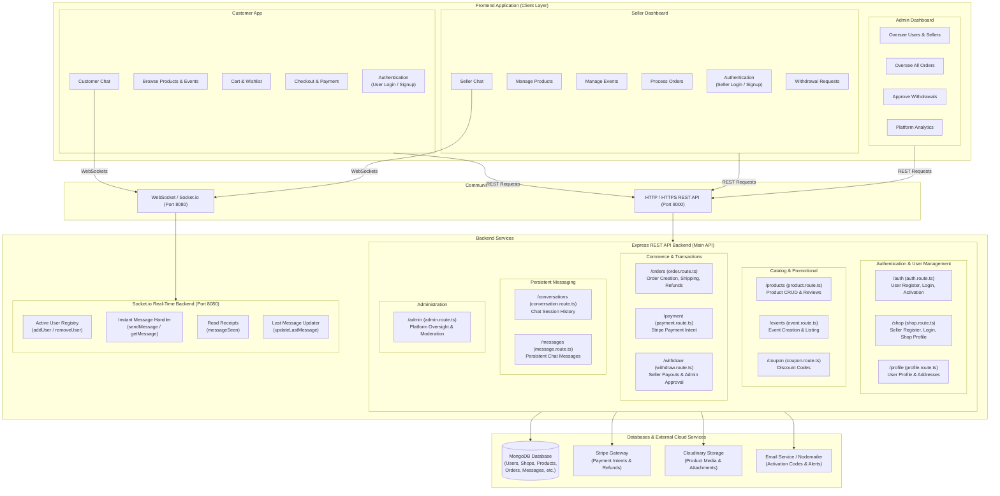
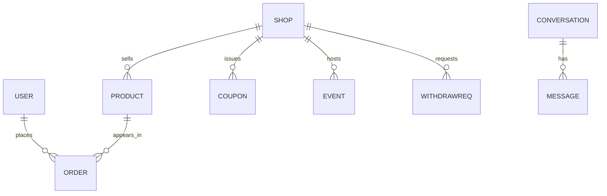
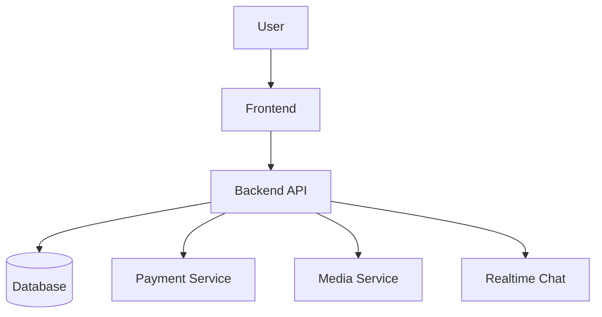
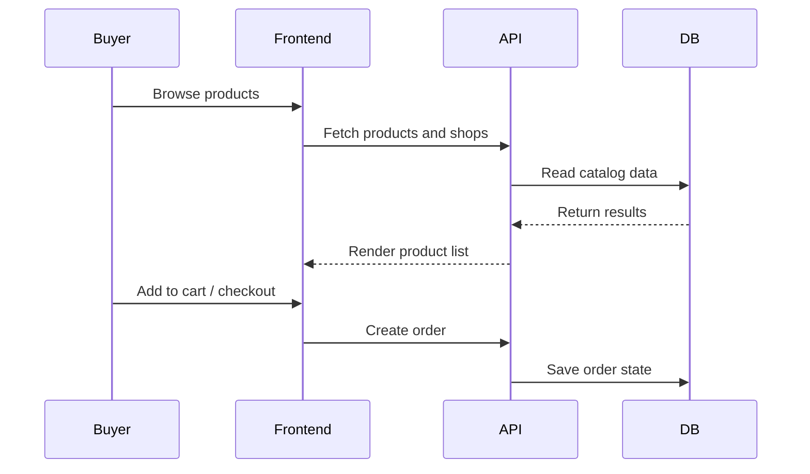
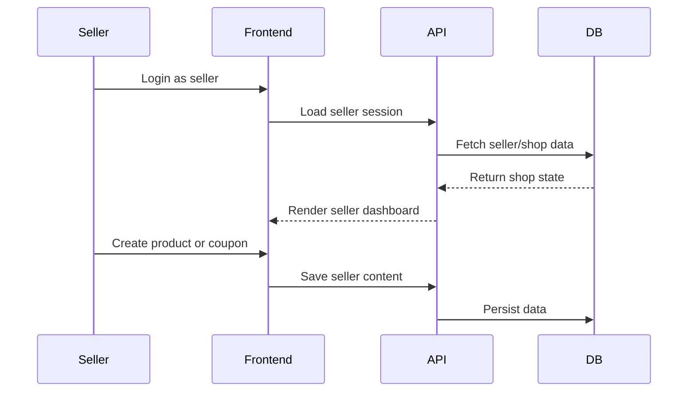

# Multi-Vendor E-commerce Platform

Live demo: https://multi-vendor-ecommerce-fe.vercel.app/

## Overview and Goals

This project is a full-stack marketplace for three different user groups: customers, sellers, and administrators. The main problem it addresses is that a modern ecommerce platform needs more than a simple product listing page. It needs a working flow for authentication, product management, checkout, seller operations, and communication between buyers and sellers.

The product was built to give users a realistic experience of a multi-vendor marketplace while keeping the implementation manageable for a single developer. In practice, that meant focusing on the core flows that matter most:

- Buyers should be able to browse products, save favorites, place orders, and communicate with sellers.
- Sellers should be able to create shops, manage products, run promotions, and track orders.
- Admins should be able to oversee the platform and manage user-related data.

The project goal was not only to add features, but to make those flows work in a consistent and maintainable way.

## System Architecture Overview

The application is split into a frontend application and a backend API. The frontend handles the user experience, while the backend owns authentication, business rules, database access, and integrations.

| Layer      | Choice                  | Why it was used                                                                     | Trade-off                                                                           |
| ---------- | ----------------------- | ----------------------------------------------------------------------------------- | ----------------------------------------------------------------------------------- |
| Frontend   | Next.js + React         | Good fit for a full-stack app with route-based UI and a growing component structure | More setup than a simple React-only app                                             |
| State      | Redux Toolkit           | Useful for sharing auth, product, cart, and seller state across the app             | Adds some complexity compared with local component state                            |
| Backend    | Express.js + TypeScript | Clear structure for routing, middleware, and domain-based controllers               | Requires more discipline around types and structure                                 |
| Database   | MongoDB + Mongoose      | Flexible for product, user, order, and shop documents                               | Less strict than relational schemas for complex joins                               |
| Auth       | JWT + bcrypt            | Simple and practical for cookie-based sessions and role checks                      | Needs careful route protection and token handling                                   |
| Payments   | Stripe                  | Standard choice for ecommerce checkout and payment flow                             |                                                                                     |
| Media      | Cloudinary + Multer     | Better than local storage for image handling in a real app                          | Adds a third-party integration and upload dependency                                |
| Realtime   | Socket.io               | Fits the chat use case well for real-time conversations                             | Requires careful reconnection and state management                                  |
| Deployment | Vercel                  | Suitable for shipping the frontend and backend services with a lightweight setup    | Some production behaviors depend on environment and platform-specific configuration |

## Architecture Diagram



### Detailed Architectural Breakdown

#### 1. Microservice Separation: Express API vs Socket Backend
- **Express REST API Backend (`Port 8000`)**: Primary backend managing authentication, product catalog, orders, payment webhooks, database persistence (MongoDB), file uploads (Cloudinary), and email services.
- **Socket.io Real-Time Server (`Port 8080`)**: Dedicated microservice managing WebSocket connections, active user socket registries (`addUser`/`removeUser`), low-latency messaging (`sendMessage`/`getMessage`), read receipts (`messageSeen`), and real-time chat list updates (`updateLastMessage`).

#### 2. Express Route & Domain Capabilities (`backend/src/routes/`)
- **`auth.route.ts` (`/auth`)**: User Registration, Email Activation token verification, Login, Logout.
- **`shop.route.ts` (`/shop`)**: Seller Sign up, Seller Activation, Login, Shop Profile updates.
- **`product.route.ts` (`/products`)**: Create product (Seller), View/Filter product catalog (User), Shop specific products, Reviews.
- **`event.route.ts` (`/events`)**: Create event promotions (Seller), View active events (User).
- **`profile.route.ts` (`/profile`)**: Manage user profile data, delivery addresses, password updates.
- **`coupon.route.ts` (`/coupon`)**: Seller discount code creation and checkout validation.
- **`payment.route.ts` (`/payment`)**: Stripe payment intent initialization & checkout key handling.
- **`order.route.ts` (`/orders`)**: Order creation, order tracking (Processing $\rightarrow$ Shipping $\rightarrow$ Delivered), refund handling.
- **`conversation.route.ts` (`/conversations`)**: Fetch & create active chat sessions between users and shops.
- **`message.route.ts` (`/messages`)**: Save and fetch chat message history.
- **`withdraw.route.ts` (`/withdraw`)**: Seller payout request creation and Admin approval workflow.
- **`admin.route.ts` (`/admin`)**: Admin oversight, manage users/sellers, monitor orders and system metrics.

#### 3. Role Responsibilities
- **Customer**: Browse products & events, manage Cart & Wishlist, checkout via Stripe, chat live with shops.
- **Seller**: Manage shop catalog (products & events), issue coupons, process order states, submit withdrawal requests, chat live with customers.
- **Admin**: System-wide oversight over users, sellers, products, and orders; approve or reject seller withdrawal requests.

## Key Features

### Multi-role system

The platform is built around three roles: buyer, seller, and admin. Access control is enforced at the API layer through route guards and middleware, not only in the UI. This is important because the real risk in a marketplace is privilege escalation if a user manipulates request payloads or reaches an endpoint that should be restricted.

### Product management and shopping

Sellers can create and manage shops and products, while buyers can browse products, save items to wishlist, and add them to cart. The main engineering challenge here is keeping product state consistent, especially when inventory is limited. For the current scope, the system uses server-side validation and request checks, which is acceptable for the current scale, but it would need stronger inventory reservation logic if traffic grows significantly.

### Payments

Stripe is used for checkout and payment flow. The important design consideration is that payment confirmation and order creation must stay consistent even if the server fails mid-flow. In a production system, this would require webhook idempotency and reconciliation logic so duplicate or partial states do not happen.

### Real-time messaging

The chat flow uses Socket.io so buyers and sellers can exchange messages in real time. The main concern here is reliable connection handling, especially when users refresh, reconnect, or open multiple tabs. The app needs a stable reconnection strategy and clean room for conversation state so the UI does not end up showing stale or duplicated messages.

### Seller dashboard

The seller side includes product management, coupon handling, events, orders, and balance-related actions. The main design concern was keeping the seller experience simple without overloading the UI with too many data dependencies. The current version focuses on core merchant workflows rather than advanced analytics or reporting.

## API Architecture by Domain

The backend follows a feature-based structure where each domain has its own controller, route, model, and middleware layer. This makes the API easier to reason about and easier to extend as new marketplace features are added.

```text
backend/src/routes/
  auth.route.ts
  shop.route.ts
  product.route.ts
  order.route.ts
  payment.route.ts
  conversation.route.ts
  message.route.ts
  admin.route.ts
  withdraw.route.ts
```

The main domains are:

- Auth: login, verification, session loading, logout
- Shop: seller registration, shop creation, seller profile data
- Products: product creation, product listing, shop-specific products
- Orders: order lifecycle and order-related actions
- Payments: Stripe integration and payment flow
- Conversations and Messages: chat-related API and socket integration
- Admin: admin-only operations and data access
- Withdraw: seller balance and withdrawal requests

This structure is useful because it keeps business logic grouped by feature instead of by HTTP verb.

## Brand Value Propositions

The platform is not only a technical experiment. It is designed to create business value for the marketplace:

- Buyers can get answers quickly through chat, which reduces hesitation and improves confidence in purchase decisions.
- Sellers can manage their store from one place, which lowers operational overhead.
- Admins can monitor platform activity, which helps maintain a healthier marketplace.
- A simple checkout and payment flow improves the chance of conversion.

In a product-led company, these outcomes matter as much as the code quality itself.

## Tech Stack

### Backend

- Node.js
- Express.js
- TypeScript
- MongoDB + Mongoose
- JWT + bcrypt
- Stripe
- Cloudinary + Multer
- Nodemailer / Resend
- Zod for validation

### Frontend

- Next.js
- React
- Redux Toolkit
- Tailwind CSS
- Socket.io client
- React Toastify

### What was considered and rejected

A custom backend was chosen instead of a full BaaS provider because marketplace-specific logic around auth, role control, seller operations, and payment flow is too important to outsource to a rigid platform. The trade-off is more engineering effort, but the system is more flexible and easier to adapt to business requirements.

## Challenges and Solutions

This is one of the most important parts of the project because most of the real work was about making the flows behave correctly rather than just adding screens.

| Challenge                                                                                      | Solution                                                                                                                                                                         |
| ---------------------------------------------------------------------------------------------- | -------------------------------------------------------------------------------------------------------------------------------------------------------------------------------- |
| Authentication and verification were unreliable at first.                                      | The auth flow was tightened around route guards, session loading, and verification handling to create a more predictable login and access experience for both users and sellers. |
| Seller and user state often conflicted.                                                        | Role-specific state ownership was separated more clearly, and buyer/seller flows were initialized independently to reduce UI conflicts.                                          |
| Chat behavior was fragile during real use.                                                     | Conversation loading and socket-based updates were structured more carefully, and message state was kept separate from other UI state to reduce stale or duplicated behavior.    |
| File uploads needed a production-ready path.                                                   | The app was moved toward Cloudinary-backed uploads for products and profile images, making media handling more scalable and maintainable.                                        |
| Protected routes and access control needed to be stricter.                                     | Route guards were applied more carefully so users and sellers are redirected to the appropriate pages based on their current role and session state.                             |
| Seller balance and withdrawal flow needed better state updates.                                | Seller-specific state is refreshed after actions that affect balances or withdrawals so the UI reflects the latest information more consistently.                                |
| Mobile layout issues made some flows harder to use.                                            | Spacing, layout, and screen behavior were improved so the main flows became easier to use on smaller screens.                                                                    |
| Socket reliability was inconsistent when using a single connection for both sellers and users. | Separate socket connections were created for users and sellers so realtime chat and updates became more reliable and consistent.                                                 |

## Database ERD

The project uses a document-based MongoDB model with collections for users, shops, products, orders, conversations, messages, coupons, events, and withdrawal requests.



The important design choice here is that the schema is practical for a marketplace application rather than fully normalized for every possible relational join. This keeps the implementation simpler and matches the way the app actually uses the data.

## Application Flow Diagrams

### Overall flow



### Buyer flow



### Seller flow



## Best Practices

### Authentication and security

The backend uses middleware-based route protection and role-sensitive access control. Passwords are hashed, and sensitive sessions are handled through server-side validation rather than trusting the client alone.

### Component architecture

The frontend is split into reusable UI components and state-driven sections so the app stays maintainable. The main idea was to keep business UI logic close to the relevant feature instead of scattering it across the whole app.

### Error handling and UX

The app uses clear feedback for user actions, especially around auth, cart, checkout, and messaging. The goal was to make the app feel more reliable even when some flows still need further hardening in production.

## Getting Started

### Prerequisites

- Node.js
- npm
- MongoDB
- Stripe account
- Cloudinary account

### Backend

```bash
cd backend
npm install
npm run dev
```

### Frontend

```bash
cd frontend
npm install
npm run dev
```

## Conclusion

This project is a realistic full-stack marketplace implementation rather than a toy demo. The most valuable part of the work was not only building the feature set, but making the product feel coherent across authentication, seller operations, cart, payments, and chat. The biggest lessons came from improving reliability, separating role-based state, and making the system behave more predictably as it grew.
